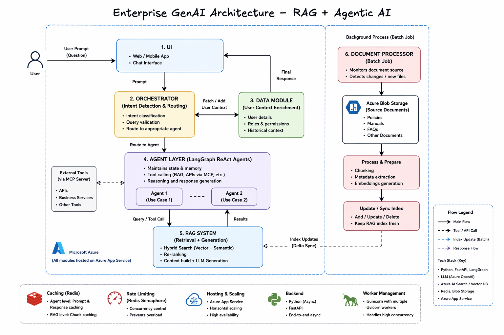

# Enterprise GenAI Platform – RAG + Agentic AI System

## Overview
This project represents a conceptual implementation of an enterprise-scale Generative AI platform serving hundreds of thousands of users across internal business use cases.

The system is designed to provide accurate, context-aware responses from large document repositories using Retrieval-Augmented Generation (RAG) and Agentic AI workflows.

---

## Problem
Organizations often deal with large volumes of unstructured data such as documents, policies, and knowledge bases, making it difficult to retrieve accurate and relevant information efficiently.

---

## Solution
Designed and implemented an AI-first system combining:

- RAG (Retrieval-Augmented Generation)
- Agent-based workflows (ReAct pattern)
- LLM-based reasoning and orchestration

---

## High-Level Architecture

User Query (UI)  
→ Orchestrator  
→ Intent Detection & Validation  
→ Routing to Use Case  
→ Agent Execution (ReAct Agent)  
→ Tool Calling (RAG + APIs)  
→ Response Generation  
→ Context Maintenance (State)  
→ Response to UI  

---

## System Design Details

### Orchestration Layer
- Central orchestrator handles:
  - Query validation  
  - Intent classification  
  - Routing to appropriate use case  
- Supports multiple AI-driven use cases

---

### Agent Layer
- Built using **ReAct-style agents**
- Each agent:
  - Maintains conversational state  
  - Performs multi-step reasoning  
  - Dynamically invokes tools  

---

### Tooling Layer
Agents interact with multiple tools:

- RAG pipeline for knowledge retrieval  
- External APIs (abstracted tool integrations)  

---

### RAG Architecture

- Document ingestion and chunking  
- Embedding generation  
- Vector storage with multi-tenant indexing strategy  
- Hybrid retrieval:
  - Vector search  
  - Semantic search  
- Re-ranking using advanced ranking models  

---

### Advanced Design Decisions

- Multi-tenant vector indexing for better retrieval quality  
- Structured handling of complex documents (e.g., tables)  
- Metadata-based filtering for improved relevance  

---

### State Management(Redis, Postgres, contextvar)

- Conversation context maintained within agent  
- Enables:
  - Multi-turn interactions  
  - Context-aware responses  
- Agent decides whether to:
  - Retrieve new data  
  - Or respond using existing context  

---

### Caching Strategy(Redis)

- Multi-level caching approach:
  - Prompt-response caching at agent level  
  - Retrieval caching at document/chunk level  

---

### Rate Limiting(Semaphore)

- Concurrency control using distributed mechanisms  
- Prevents system overload under high traffic  

---

### Backend & APIs

- Python-based backend using asynchronous programming  
- API layer built for scalable request handling  

---

### Deployment & Scaling

- Cloud-based deployment  
- Horizontal scaling supported  
- Multi-worker architecture for handling concurrent requests  
- Designed for high availability and performance  

---

## Tech Stack

- Python, FastAPI (Async APIs)  
- LangChain (RAG pipelines)  
- LangGraph (Agentic workflows)  
- LLM APIs (OpenAI / Azure OpenAI)  
- Vector Databases (Azure AI Search)
- Embedding(Azure Embedding 3k -Large)
- Retrivel (Azure semantic Hybrid search)
- Redis (Caching, Rate Limiting)  
- Docker, Cloud Deployment(Azure App services)  

---

## Key Contributions

- Built end-to-end RAG pipelines for enterprise use cases  
- Developed agent-based workflows with tool calling  
- Designed orchestration layer for multi-use-case routing  
- Improved response accuracy using semantic search and re-ranking  
- Solved real-world challenges:
  - Hallucination mitigation  
  - Retrieval noise  
  - Complex document handling  
- Optimized latency and cost through caching and efficient design  

---

## Production Impact

- System designed for large-scale usage  
- Handles real-time AI-driven queries  
- Improves information access efficiency  
- Reduces dependency on manual support systems  

---

## Learnings

- Retrieval quality is critical in RAG systems  
- System design and orchestration are key for production AI  
- Handling real-world data requires iterative improvements  

---
## Architecture Diagram

Enterprise _Gen AI_Arcitecture.png

## Disclaimer

This is a conceptual representation based on experience building enterprise AI systems.  
All details are generalized and anonymized to maintain confidentiality.
